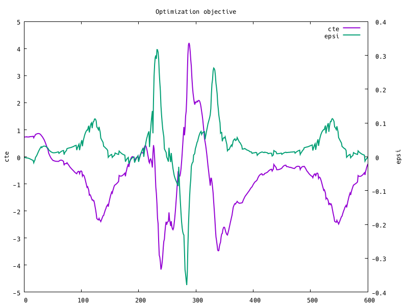
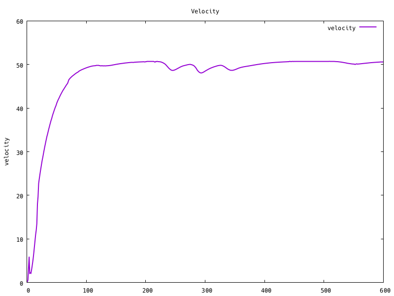
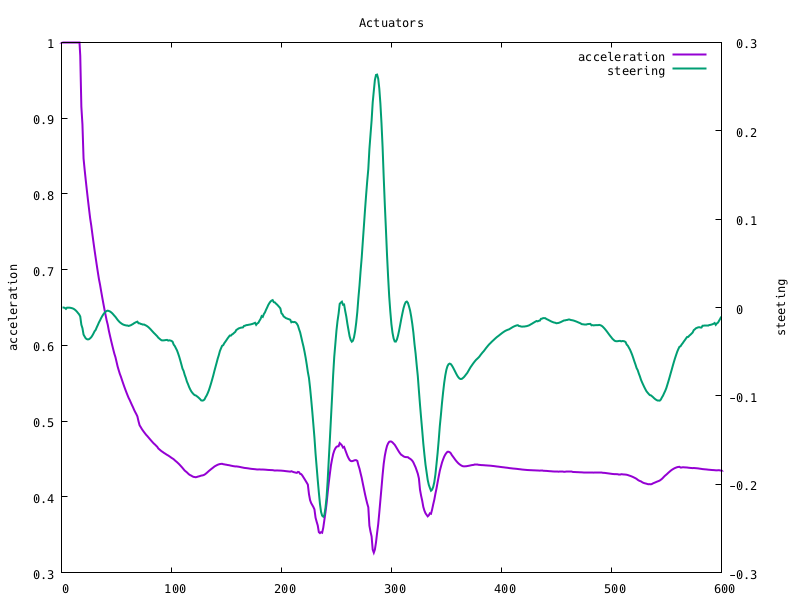

# Model Predictive Control Project

[](http://www.udacity.com/drive)
[](https://semaphoreci.com/sgalkin/carnd-t2p5)
[](https://codecov.io/gh/sgalkin/CarND-T2P5)
[](https://circleci.com/gh/sgalkin/CarND-T2P5)

---

## Overview
This project implements controlling application for Udacity self-driving car
simulator using MPC (Model Predictive Control) controller mechanism.

**Project objective**: No tire may leave the drivable portion of the track
surface. The car may not pop up onto ledges or roll over any surfaces that would otherwise be considered unsafe (if humans were in the vehicle).

## Demo

`./t2p5 -N 7`

[Video](https://vimeo.com/252804201)

---

## Usage
```sh
Usage:
  t2p5 [options]
Available options:
  -o, --output  CSV output
  -d, --delay   Control delay, ms (default: 100)
  -h, --help    print this help screen
  -N, --depth   Prediction depth (default: 8)
  -p, --port    Port to use (default: 4567)
  -t, --dt      Prediction time step, ms (default: 125)
```

## Dependencies
### Runtime
* [Term 2 Simulator](https://github.com/udacity/self-driving-car-sim/releases)

### Tools
* `cmake` >= 3.5
  * All OSes: [click here for installation instructions](https://cmake.org/install/)
* `make` >= 4.1 (Linux, Mac), 3.81 (Windows)
  * Linux: make is installed by default on most Linux distros
  * Mac: [install Xcode command line tools to get make](https://developer.apple.com/xcode/features/)
  * Windows: [Click here for installation instructions](http://gnuwin32.sourceforge.net/packages/make.htm)
* `gcc/g++` >= 5.4, clang
  * Linux: gcc/g++ is installed by default on most Linux distros
  * Mac: same deal as make - [install Xcode command line tools](https://developer.apple.com/xcode/features/)
  * Windows: recommend using [MinGW](http://www.mingw.org/)

### Libraries not included into the project
* [`uWebSocketIO`](https://github.com/uWebSockets/uWebSockets) == v0.13.0
  * Ubuntu/Debian: the repository includes [`install-ubuntu.sh`](./scripts/install-ubuntu.sh) that can be used to set
    up and install `uWebSocketIO`
  * Mac: the repository includes [`install-mac.sh`](./scripts/install-mac.sh)
    that can be used to set up and install `uWebSocketIO`
  * Windows: use either Docker, VMware, or even [Windows 10 Bash on     Ubuntu](https://www.howtogeek.com/249966/how-to-install-and-use-the-linux-bash-shell-on-windows-10/)
* [`Ipopt`](https://projects.coin-or.org/Ipopt) >= 3.12.7
  * Ubuntu/Debian/Mac: the repository includes [`install_ipopt.sh`](./scripts/install_ipopt.sh) that can be used to set up
  and install `Ipopt`
  * Please refer to [this document](https://github.com/udacity/CarND-MPC-Project/blob/master/install_Ipopt_CppAD.md) for installation instructions.
* [`CppAD`](https://www.coin-or.org/CppAD)
  * Ubuntu/Debian: it is possible to use standard packet manager `apt` to install

### Libraries included into the project
* [`Eigen`](http://eigen.tuxfamily.org/index.php?title=Main_Page) - C++ template library for linear algebra: matrices, vectors, numerical solvers, and related algorithms
* [`JSON for Modern C++`](https://github.com/nlohmann/json) - JSON parser
* [`Catch2`](https://github.com/catchorg/Catch2) - Unit-testing framework
* [`ProgramOptions.hxx`](https://github.com/Fytch/ProgramOptions.hxx) - Single-header program options parsing library for C++11

## Build
### Pre-built Docker container
0. docker pull sgalkin/carnd-t2p5

### Manual build using containerized development environment
0. Clone this repo.
1. `mkdir build`
2. `cd build`
3. `cmake .. -DCMAKE_BUILD_TYPE=Release -DLOCAL_BUILD=OFF -DDOCKER_BUILD=ON`
4. `make docker-build`
5. `make docker-test`
6. `make docker-run` or `make docker-shell; ./t2p5`

### Local manual build
0. Clone this repo.
1. `mkdir build`
2. `cd build`
3. `cmake .. -DCMAKE_BUILD_TYPE=Release -DLOCAL_BUILD=ON -DDOCKER_BUILD=OFF`
4. `make`
5. `make test`

## Protocol
The project uses `uWebSocketIO` request-response protocol in communicating with the simulator.

_INPUT_: values provided by the simulator to the c++ program
```json
{
  "ptsx": "(Array<float>) - The global x positions of the waypoints",
  "ptsy": "(Array<float>) - The global y positions of the waypoints.
          This corresponds to the z coordinate in Unity since y is the up-down
          direction",
  "psi": "(float) - The orientation of the vehicle in **radians** converted
         from the Unity format to the standard format expected in most mathemetical functions (more details below)",
  "psi_unity": "(float) - The orientation of the vehicle in **radians**",
  "x": "(float) - The global x position of the vehicle",
  "y": "(float) - The global y position of the vehicle",
  "steering_angle": "(float) - The current steering angle in **radians**",
  "throttle": "(float) - The current throttle value [-1, 1]",
  "speed": "(float) - The current velocity in **mph**"
}
```

`psi`

```
//            90
//
//  180                   0/360
//
//            270
```

`psi_unity`

```
//            0/360
//
//  270                   90
//
//            180
```

_OUTPUT_: values provided by the c++ program to the simulator
```json
{
  "steering_angle": "desired steering angle [-1, 1]",
  "throttle": "desired throttle [-1, 1]",
  "mpc_x": "list of x-coordinates of MPC prediction (debug output)",
  "mpc_y": "list of y-coordinates of MPC prediction (debug output)",
  "next_x": "list of x-coordinates of reference trajectory (debug output)",
  "next_y": "list of y-coordinates of reference trajectory (debug output)",
}
```

## Model
The project uses kinematic model presented in the class.

### State
  * `psi` - orientation of the car (related to heading in the first step)
  * `v` - car velocity
  * `x` - x-coordinate (related to initial car position)
  * `y` - y-coordinate (related to initial car position)
  * `cte` - cross track error - the distance between current position and
    reference trajectory
  * `epsi` - orientation error - difference between car orientation and a
    tangent of reference trajectory in the given point

### Actuators
  * `a` - acceleration of the car, range limited to [-0.05, 1]
  * `d` - steering angle, range limited to [-18 ,18] degrees

### Main terms of the cost function
  * `pow(cte, 2)` - enforces following the trajectory
  * `pow(epsi, 2)` - enforces following the trajectory
  * `pow((v - vref)/vref, 2)` - enforces car to go, instead of staying in the local
    optima


  * `max(cte) over depth` - reduces oscillation around trajectory
  * `max(epsi) over depth` - reduces oscillation around trajectory


  * `a/(a_upper - a_lower)` - relative acceleration, penalize use of acceleration
  * `d/(d_upper - d_lower)` - relative steering angle, penalize use of steering wheel


  * `(a_t+1 - a_t)/(a_upper - a_lower)` - relative acceleration change, improves
    smoothness of acceleration
  * `(d_t+1 - d_t)/(d_upper - d_lower)` - relative steering angle, improves
    smoothness of steering, reduces oscillation arount trajectory

## Pipeline
Each state was passed through the following pipeline
  * Coordinates transformation - converts world coordinates system into car
    coordinates system
  * Control latency processing - the current values of actuators was applied
    to input in order to compensate control latency. `dt` - exected latency
  * MPC - which consists of
    * Fitting a polynomial into waypoints. `3rd` degree polynomial was used
      in the projects
    * Actuators optimization using polynomial from the previous step as
      a reference trajectory. Depth and time span between control inputs
      are configurable via command line parameters

### Results






## TODO
1. Try to use different cost function.
2. Increase code coverage
<!--stackedit_data:
eyJoaXN0b3J5IjpbLTIwMjA4NTc1NDJdfQ==
-->